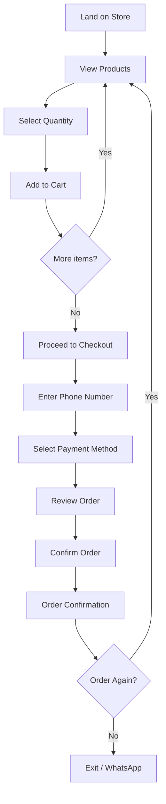
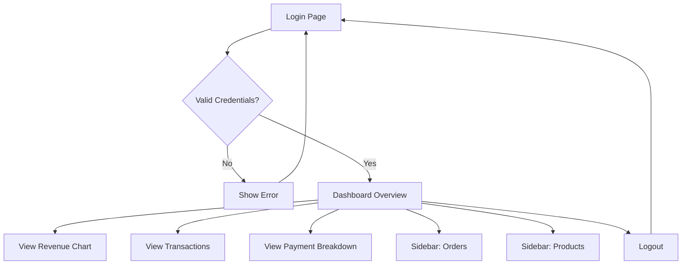

# 5. User Journey Flows

## 5.1 Customer Purchase Flow

**Goal:** Order products in under 60 seconds

```
┌─────────────────────────────────────────────────────────────────┐
│  ENTRY: Product Catalog                                         │
│  ─────────────────────                                          │
│  • Land on product grid (1-2 products displayed)                │
│  • Large product images, clear prices                           │
│  • Quantity selector visible on each product card               │
│                                                                 │
│         ↓ [Select quantity + Add to Cart]                       │
│                                                                 │
├─────────────────────────────────────────────────────────────────┤
│  CART UPDATE: Real-time feedback                                │
│  ────────────────────────────                                   │
│  • Cart panel updates (desktop: right side / mobile: FAB badge) │
│  • Running total visible                                        │
│  • Can adjust quantities or remove items                        │
│                                                                 │
│         ↓ [Proceed to Checkout]                                 │
│                                                                 │
├─────────────────────────────────────────────────────────────────┤
│  CHECKOUT: Single-page progressive flow                         │
│  ──────────────────────────────────────                         │
│  Step 1: Phone number input (with country code MX default)      │
│          → Auto-format, validation feedback                     │
│                                                                 │
│  Step 2: Payment method selection                               │
│          → Bank transfer (show account details)                 │
│          → Cash/card on delivery                                │
│          → Stripe card payment                                  │
│                                                                 │
│  Step 3: Order summary review                                   │
│          → Items, quantities, total                             │
│          → Payment method selected                              │
│                                                                 │
│         ↓ [Confirm Order]                                       │
│                                                                 │
├─────────────────────────────────────────────────────────────────┤
│  CONFIRMATION: Success state                                    │
│  ───────────────────────────                                    │
│  • Order reference number                                       │
│  • Summary of what was ordered                                  │
│  • Next steps based on payment method                           │
│  • WhatsApp link for delivery coordination (optional)           │
│  • "Order again" shortcut                                       │
└─────────────────────────────────────────────────────────────────┘
```

**Key UX Decisions:**
- **Entry point:** Product catalog (not single product) — scalable for future products
- **Quantity selection:** On product card, before add-to-cart — reduces steps
- **Checkout:** Single page with progressive sections — fast but not overwhelming
- **No account required:** Phone number only — zero friction

**Error States:**
- Invalid phone number → Inline error, clear format hint
- Payment selection required → Highlight payment options
- Network error → Retry button, preserve cart state

---

## 5.2 Admin Dashboard Flow

**Goal:** Immediate business clarity on login

```
┌─────────────────────────────────────────────────────────────────┐
│  ENTRY: Login Page                                              │
│  ─────────────────                                              │
│  • Clean, branded login form                                    │
│  • Email + Password fields                                      │
│  • "Remember me" checkbox                                       │
│  • Password visibility toggle                                   │
│                                                                 │
│         ↓ [Login]                                               │
│                                                                 │
├─────────────────────────────────────────────────────────────────┤
│  DASHBOARD: Overview (Landing after login)                      │
│  ─────────────────────────────────────────                      │
│                                                                 │
│  ┌──────────────┬──────────────┬──────────────┐                │
│  │   REVENUE    │    ORDERS    │   PAYMENT    │                │
│  │   This Week  │    Today     │   BREAKDOWN  │                │
│  │   $X,XXX     │     XX       │   [PIE/BAR]  │                │
│  │   ↑ 12%      │              │              │                │
│  └──────────────┴──────────────┴──────────────┘                │
│                                                                 │
│  ┌─────────────────────────────────────────────┐               │
│  │  REVENUE TREND CHART                        │               │
│  │  [Line chart - daily/weekly/monthly toggle] │               │
│  └─────────────────────────────────────────────┘               │
│                                                                 │
│  ┌─────────────────────────────────────────────┐               │
│  │  RECENT TRANSACTIONS TABLE                  │               │
│  │  Date | Customer | Amount | Payment Method  │               │
│  │  ─────────────────────────────────────────  │               │
│  │  ...  | ...      | ...    | ...             │               │
│  └─────────────────────────────────────────────┘               │
│                                                                 │
├─────────────────────────────────────────────────────────────────┤
│  SIDEBAR NAVIGATION                                             │
│  ──────────────────                                             │
│  • Dashboard (current)                                          │
│  • Orders (view all orders)                                     │
│  • Products (CRUD - post-demo)                                  │
│  • Settings (future)                                            │
│  • Logout                                                       │
└─────────────────────────────────────────────────────────────────┘
```

**Key UX Decisions:**
- **Post-login landing:** Dashboard with ALL key metrics visible immediately
- **First impression:** Revenue + Orders + Payment breakdown — the "wow" moment
- **Data hierarchy:** KPI cards at top, trend chart middle, transactions table bottom
- **Navigation:** Sidebar for future scalability (Orders, Products, Settings)

**Error States:**
- Invalid credentials → Inline error, clear message
- Session expired → Redirect to login with message
- Data loading error → Skeleton states, retry option

---

## 5.3 Flow Diagrams (Mermaid)

**Customer Purchase Flow:**


**Admin Dashboard Flow:**


---
